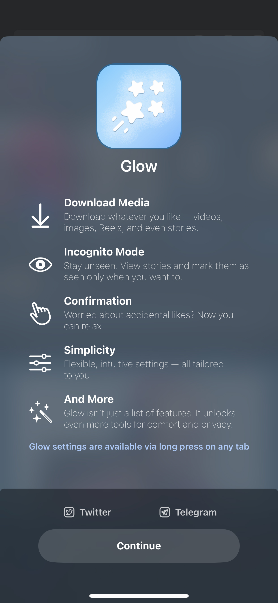
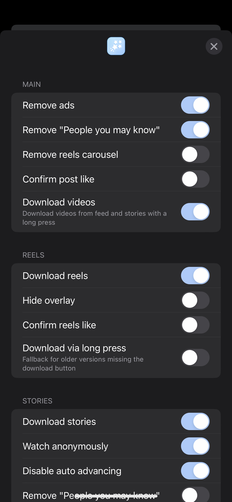
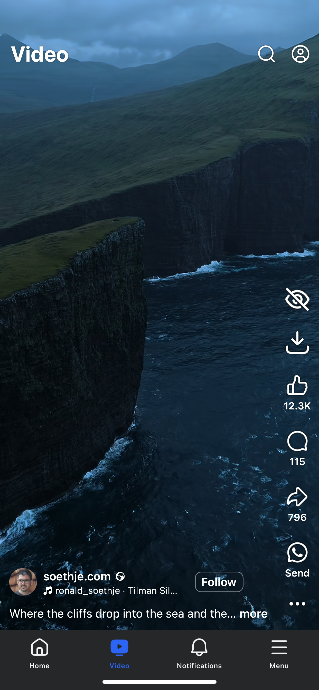
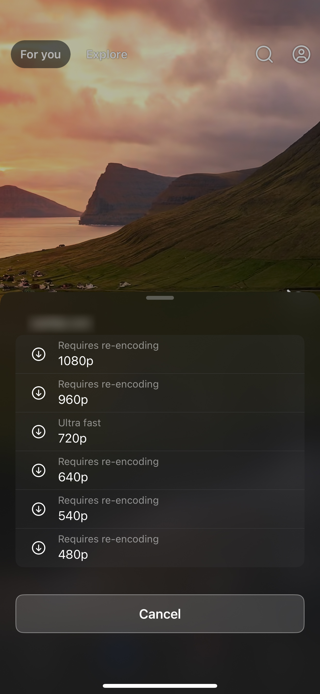
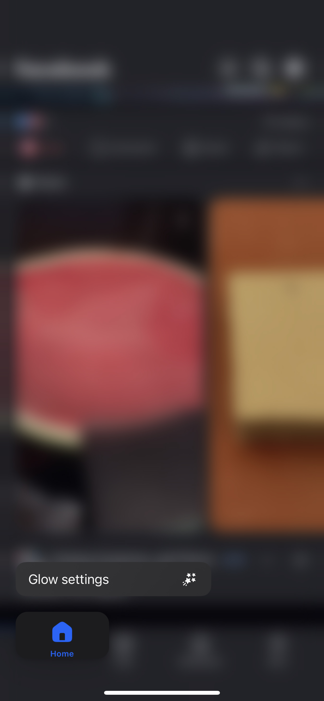

# Glow for Facebook
A simple, clean, and powerful tweak for Facebook

## Screenshots
<table>
   <tr>
      <td></td>
      <td></td>
      <td></td>
   </tr>
</table>

  
More screenshots

  <table>
    <tr>
      <td></td>
      <td></td>
    </tr>
  </table>

## Main Features
<li>Download Media: Download whatever you like — videos, images, Reels, and even stories</li>
<li>Anonymity: Stay unseen. View stories and mark them as seen only when you want to</li>
<li>Confirmation: Worried about accidental likes? Now you can relax</li>
<li>Simplicity: Flexible, intuitive settings — all tailored to you</li>
<li>And More: Glow isn’t just a list of features. It unlocks even more tools for comfort and privacy</li>
 

**Glow settings are available via long press on any tab**
